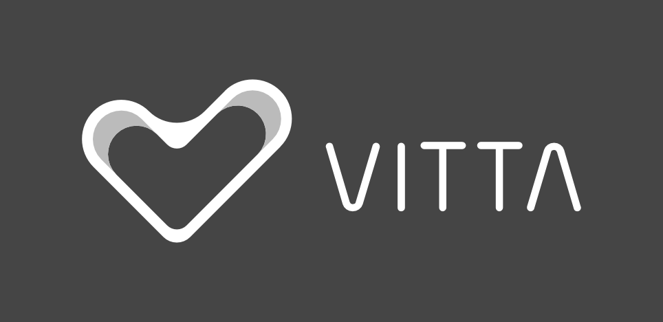

# Vitta

Glad to meet you friend!

We are more than happy to see you are interested on our challenge!

## About Us

You can get to know more about us!

| [Blog](https://blog.vitta.me/) (in pt-BR) | [Facebook](https://www.facebook.com/vitta.me/) | [LinkedIn](https://www.linkedin.com/company/3990515/) |
|:---:|:---:|:---:|

### Open positions

You can check them out following this link [jobs.lever.co/vitta](jobs.lever.co/vitta)!

## Worth reading

Your solution will be the mirror of your professional and academic carrer, please care to make it worth!

- Try always to develop your solutions using the latest versions of each technology;
- Your goal is to show how good you are with:
    - Design patterns like singleton, factory, strategy, mediator;
    - Reuse of code and packages;
    - Organization and structure patterns;
    - Nomenclature and adoption to patters;
- If you are not sure, just do it;
- Try always to make services as independent and separated as possible;

## Challenges

Choose your challenge below:

- [Back-End](https://github.com/vitta-hiring/case-back-end)
- Design (soon)
- DevOps & Infrastructure (soon)
- [Front-End](https://github.com/vitta-hiring/case-front-end)

### Delivering your solution

Pretty simple!

1. Save your solution on a public `Github` repository as `vitta-challenge`;
1. Send an e-mail to `recrutamento@vitta.me` with the link to the repository;
